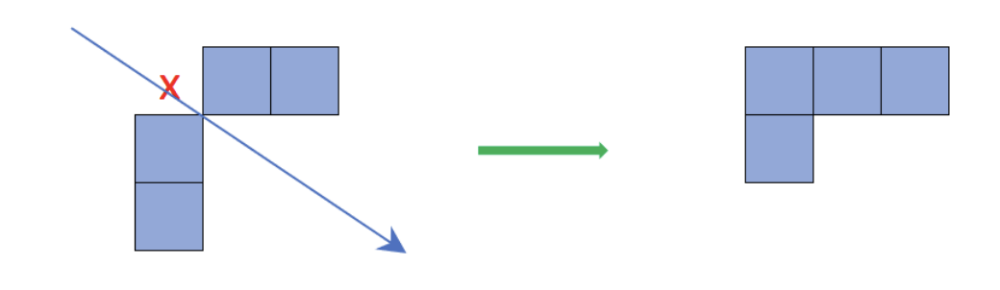
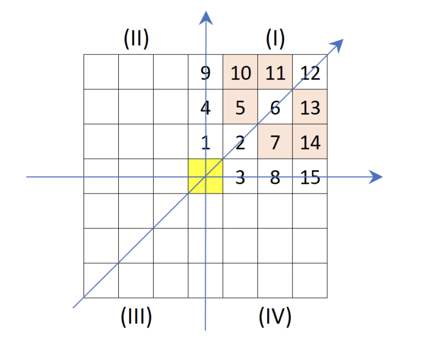
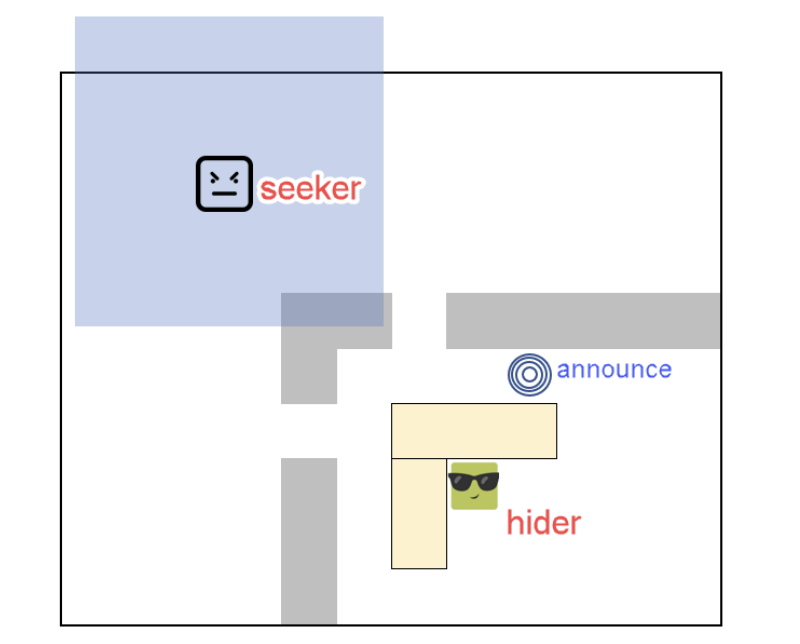

# Artificial Intelligence: Project

## Hide and Seek

## Description

The game is held on a 2D rectangle/square board with limited width and height in the cell
unit, and its edges are parallel with screen’s. Inside the game board, there are walls,
some movable obstacles (shape: rectangle, square), a seeker, some hiders. You are
required to make this game with intelligence agents.
There are some rules in the game you need to know carefully:

- The board is covered by wall.
- The walls and obstacles are placed perpendicular to the board, not oblique. We
  should not create a gap between two walls by placing two blocks together only at
  one vertex.

- Each agent takes up one cell in space.
- Agents can move in 8 directions (left, right, up, down, …) but not move over or through objects.
- Each agent only moves to the next one cell at a time and it takes them one unit in
  distance.
- In the beginning, agents know the map clearly such as the map size, their position
  on the map, wall position, obstacles.
- The game is over if seeker catch all hiders (win) or time out (lose). The seeker
  must touch the hiders if they want to catch them.
- The agent can observe within a certain range (for simple, in a square with a radius
  is 3 units). When there are walls/obstacles in this area, they will hide some cells.

We consider the first quarter, and the remaining quarters are the same.

- Any cell in the blue line will block the following cells if it is placed with
  wall/obstacles. For example, if c1 is blocked, c4 and c9 are hidden.
- c5 hides c10, c11
- c7 hides c13, c14
  Introduction to Artificial Intelligence 3
  2024
- c2 hides c11, c13 more.
- c1 hides c10 more
- c3 hides c14 more.
  While moving, you need to mark observable cells.
  After about 5-10 units of time (steps), hiders announce their location to the seeker when
  they are in turn. However, hiders just announce one random cell around their location in
  3 unit range.

To solve it from simple to advance, I build up the 4 different levels:

- Level 1: There is only one hider and remain in place all time. Don’t limit time
  (maximum steps).
- Level 2: There are many hiders and remain in place all time. The seeker knows
  the number of hiders. Don’t limit time.
- Level 3: Hiders can be movable but they only observe in 2 units range. Each agent
  moves in turn. Don’t limit time.
- Level 4: Hiders can move obstacles to other places before the game start (seeker
  do his task) and hiders cannot change them during the game is happening. Time
  is limited. The seeker can move obstacles. All obstacles are repositioned in valid
  operation.

Game points are calculated as the following rules:

- Each moving step, your point will be decreased by 1.
- Each hider the seeker catch, 20 points will be given.

## Specifications

**Input**: the given graph is represented by its adjacency matrix, which is stored in the
input file, for example, `map1.txt`. The input file format is described as follows:

- The first line contains two integers `N x M`, which is the size of map.
- `N` next lines represent the `N x M` map matrix. Each line contains `M` integers.
  The number at `[i, j]` (row i, column j) determines whether wall, hiders or seeker
  is set. If there is wall at this position, we will have value `1`. If there is hider, we
  will have value `2`. If there is seeker, we will have `3`. Otherwise (empty path), we
  will have `0`.
- The last lines store `4` pair numbers indicate top, left, bottom, right of each
  obstacle.

**Output**:

- If you don’t use graphic, you can display a result map in text file with pathfinding
  for seeker, path length, game point such as `result1.txt`. You can display each
  step of moving or display all steps in one map. However, in case that hiders
  can move, you must separate steps clearly.
- I recommend you should use some graphic library for display results.

## Additional Notes

> Here are notes about it that the professor specifically mentioned verbally, but not in the original requirements.

- Each level should be split into each folder.
- It is advised to copy and have multiple versions of the agents, instead of an optimized agent to cover all 4 levels. (`seeker1.py`, then `seeker2.py` is just `seeker1.py` but with level 2 specific instructions, etc.)
- Forced to use A\* algorithm _somewhere_ in the project.
- Until the hider _announces_, the seeker is expected to "wander aimlessly and randomly".
- An announcement may only be seen within the seeker's vision.

## Why This Project?

There are a lot of illogical things in the document provided, and none of my friends are willing to stand up to the teacher, and scared to deviate on another path. I'm disappointed in the learning materials, this is why I moved all of my work to this repository, after all, a mother can't abandon her children right?

Also, here are a few reasons why I think the original description was badly designed. I believe programming is also a creative process, and just because it's different from the professor and everyone else, doesn't mean it's wrong.

> **Using numbers as a visual representation of the map**
>
> Not a very big point, but this makes the map very cluttered and difficult to read. I think it would make more sense to use characters to represent the map, such as `#` for walls, `H` for hiders, `S` for seekers, etc instead of `1` for walls, `2` for hiders and `3` for seekers.

 

> **Both seeker and hiders can move maximum 1 step**
>
> This is a weird requirement. Since, if the hider has a vision of _anything_ more than 0, the seeker won't be able to catch as an optimal agent will always run away from the seeker. This is why, in my revised version, I allow the hiders to move 1 step, and the seeker to move 2 steps.

 

> **Hiders announce their location, but only when the announcement is in a seeker's vision can it see**
>
> This is also a rather unintuitive ask. I assume an announcement is like a SOS flare, or a shout across the map, that gives the seeker's a variable amount of information. This is why, I allow the seeker to see this flare, wherever it is on the map.

 

> **Wandering aimlessly and randomly until an announcement**
>
> Also a questionable ask. It seems that it is way too unoptimal for the seeker to wander aimlessly, and it's not a good way to teach about intelligent agents. This just feels like a bad understanding of what A\* does. A\* requires a known goal, and a known start, not a random wandering.

 

> **Hone in the announcement as the sole goal**
>
> The professor wants us to use an A\* to search towards the announcement. But an announcement is not our agent's ultimate goal, and should be treated as a valuable piece of information and an immediate step towards a hider. And this wouldn't work when a hider can move also.

 

> **Make the hider stupider**
>
> When inquired about how would the seeker capture the hider, if they can see and keep running, he replied with making the hider's movement random instead. This is just,... you know. At the time of writing this, I'm still designing an algorithm for a hider to optimally escape from the seeker.
